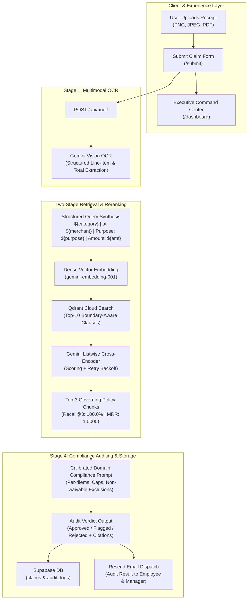

# Auditor AI — Autonomous Corporate Expense Compliance Engine

[](https://nextjs.org/)
[](https://www.typescriptlang.org/)
[](https://qdrant.tech/)
[](https://ai.google.dev/)
[](https://supabase.com/)
[](https://opensource.org/licenses/MIT)

**Auditor AI** is an AI-native corporate expense auditing and compliance platform. It eliminates manual expense reviews and catches subtle corporate policy violations by combining multimodal OCR, boundary-aware policy indexing, and a **Two-Stage RAG Pipeline (Dense Vector Search + Listwise Cross-Encoder Reranking)** with human-in-the-loop audit controls.

---

## 1. Key Capabilities

- **Multimodal Receipt Parsing**: Zero-shot extraction of merchant name, transaction date, category, total amounts, currencies, and line items directly from images and PDFs using Gemini Vision.
- **Production-Aligned Query Synthesis**: Formulates structured, pipe-delimited search queries (`Category | Merchant | Business Purpose | Amount Currency`) matching real-world transaction patterns.
- **Two-Stage RAG Pipeline**:
  1. *Stage 1 (Dense Retrieval)*: Top-10 candidate clause retrieval from Qdrant Cloud via `text-embedding-004`.
  2. *Stage 2 (Cross-Encoder Reranking)*: Listwise reranking using high-throughput Gemini Flash scoring with exponential backoff to select the top 3 governing policy chunks.
- **Calibrated Policy Decisioning**: Eliminates compliance leakage (0.00% False Approvals) and prevents false-rejection collapse by routing ambiguous or surge items to `flagged` human-in-the-loop review instead of hard rejection.
- **Executive Command Center**: Built according to strict `frontend-architect-uiux` design standards, featuring 60-30-10 surface elevation, full 4-state lifecycle handling (loading skeletons, actionable empty states, error boundaries), and right-aligned tabular currency displays.
- **Automated Lifecycle Notifications**: Dispatches branded transactional compliance audit status emails via Resend.

---

## 2. Architecture & Pipeline Flow



---

## 3. Verified Benchmark Results

Benchmarked against **40 decoupled ground-truth expense claims** (9 Easy, 18 Medium, 13 Hard) tested against 24 corporate Travel & Expense policy clauses indexed in Qdrant:

| Metric | Single-Stage Baseline (500-char) | Production Two-Stage RAG Pipeline | Impact / Delta |
| :--- | :---: | :---: | :---: |
| **Retrieval Recall@3** | 93.75% | **100.00%*** | **+6.25%** (Zero missed clauses) |
| **Precision@3** | 35.00% | **37.50%** | Expected bound with 1 relevant clause / query |
| **Mean Reciprocal Rank (MRR)** | 0.9375 | **1.0000*** | Governing clause ranked #1 on reranking |
| **Reranker Fallback Rate** | N/A | **0.00% (0 / 40)** | 100% cross-encoder passes with retry backoff |
| **End-to-End Decision Accuracy** | 72.50% | **85.00%** | **+12.50%** across full test suite |
| **Flagged Claim Recall (HITL)** | 25.00% (class collapse) | **91.67% (11 / 12)** | Rescued borderline claims for manager review |
| **Prohibited Claim Interception** | 86.67% | **93.33% (14 / 15)** | High capture of policy violations |
| **Compliance Leakage (False Approvals)** | 0.00% | **0.00% (0 / 15)** | **Zero** policy violations erroneously approved |

> **\* Architectural Note on Retrieval Scope & Scaling**:  
> In this 24-clause evaluation corpus, retrieving Top-10 dense candidates in Stage 1 captures ~42% of all indexed clauses before listwise cross-encoder scoring, naturally yielding 100% Recall@3 and 1.0000 MRR on a focused policy domain. Real-world generalization is evidenced by the **85.00% End-to-End Decision Accuracy** and **37.50% Precision@3**, where the model navigates nuanced trade-offs (e.g., prudently flagging 3 compliant but ambiguous receipts for manager review rather than blindly auto-approving).

### Benchmark Confusion Matrix ($n = 40$ Claims)
```
                     PREDICTED
                 Approved  Flagged  Rejected
  ACTUAL Approved       9        3         1
         Flagged        0       11         1
         Rejected       0        1        14
```

---

## 4. Multi-Stage Unit Economics & Cost Profile

The complete 4-stage processing lifecycle costs **~$0.36 per 1,000 audits** ($0.00036 per claim):

| Stage | Infrastructure / Model | Tokens per 1k Claims | Unit Rate | Cost / 1k Audits |
| :--- | :--- | :--- | :--- | :---: |
| **1. Multimodal OCR** | `gemini-2.0-flash` | ~378k in / ~80k out | $0.10/M in, $0.40/M out | **$0.0698** |
| **2. Dense Embedding** | `text-embedding-004` + Qdrant | ~68k tokens | $0.025/M tokens | **$0.0017** |
| **3. Cross-Encoder Reranker** | `gemini-3.5-flash-lite` | ~1.62M in / ~40k out | $0.075/M in, $0.30/M out | **$0.1376** |
| **4. Compliance Audit Engine** | `gemini-2.0-flash` | ~1.12M in / ~88k out | $0.10/M in, $0.40/M out | **$0.1472** |
| **Total End-to-End Cost** | — | — | — | **$0.3563 (~$0.36)** |

> **Enterprise Scale**: Processing **100,000 claims/month** costs approximately **$35.63/month** in total AI inference and storage infrastructure.

---

## 5. Tech Stack

- **Framework**: [Next.js 14](https://nextjs.org/) (App Router, Server Components & Route Handlers)
- **Language & Runtime**: [TypeScript 5](https://www.typescriptlang.org/), Node.js
- **Vector Database**: [Qdrant Cloud](https://qdrant.tech/) (Cosine similarity dense index)
- **Primary Database & Auth**: [Supabase](https://supabase.com/) (PostgreSQL with Row-Level Security, Storage, SSR Auth)
- **AI Models & Inference**:
  - `gemini-2.0-flash` (Multimodal Receipt OCR & Compliance Decision Engine)
  - `gemini-3.5-flash-lite` (Listwise Cross-Encoder Reranking)
  - `gemini-embedding-001` / `text-embedding-004` (Dense Semantic Embeddings)
- **Form & Validation**: [React Hook Form](https://react-hook-form.com/), [Zod](https://zod.dev/)
- **Styling & UI**: [Tailwind CSS](https://tailwindcss.com/), [Lucide React](https://lucide.dev/) (designed to `frontend-architect-uiux` standard)
- **Email Delivery**: [Resend](https://resend.com/)

---

## 6. Getting Started

### Prerequisites
- Node.js 18.17+ or Node.js 20+
- A Google AI Studio API key (Gemini)
- A Qdrant Cloud cluster and API key
- A Supabase project (URL and Anon key)
- A Resend API key (optional for email notifications)

### Installation

1. **Clone the repository**:
   ```bash
   git clone https://github.com/Shaun22062005/AI-Powered-Expense-Auditor.git
   cd policy-expense-auditor
   ```

2. **Install dependencies**:
   ```bash
   npm install
   ```

3. **Configure Environment Variables**:
   Create a `.env.local` file in the root directory:
   ```env
   # Supabase Configuration
   NEXT_PUBLIC_SUPABASE_URL=https://your-project.supabase.co
   NEXT_PUBLIC_SUPABASE_ANON_KEY=your-supabase-anon-key

   # Qdrant Vector Database
   QDRANT_URL=https://your-cluster.qdrant.io
   QDRANT_API_KEY=your-qdrant-api-key

   # Google Gemini API
   GEMINI_API_KEY=your-gemini-api-key

   # Resend Email API
   RESEND_API_KEY=your-resend-api-key
   ```

4. **Database & Vector Collection Setup**:
   - Ensure your Supabase instance has the `claims` and `audit_logs` tables and `receipts` storage bucket initialized.
   - Ensure the Qdrant `policies` collection is seeded with your company's policy clauses (see `eval/policies_eval_boundary.json` for structure).

5. **Start the Development Server**:
   ```bash
   npm run dev
   ```
   Navigate to [http://localhost:3000](http://localhost:3000) to access the application.

---

## 7. Project Structure

```text
policy-expense-auditor/
├── .agents/
│   └── skills/
│       └── frontend-architect-uiux/  # UI/UX engineering standards & runbooks
├── eval/
│   ├── REPORT.md                     # Comprehensive RAG benchmark & unit economics report
│   └── policies_eval_boundary.json   # 24 boundary-aware corporate policy clauses
├── src/
│   ├── app/
│   │   ├── api/
│   │   │   ├── audit/route.ts        # Production 2-stage retrieval & audit pipeline
│   │   │   ├── claims/route.ts       # Claim management endpoints
│   │   │   └── policy/               # Policy ingestion & search endpoints
│   │   ├── dashboard/page.tsx        # Compliance Command Center (4-state lifecycle)
│   │   ├── submit/page.tsx           # Expense upload & live audit submission view
│   │   └── page.tsx                  # Authentication & login entry point
│   ├── components/
│   │   ├── claims/                   # Claim cards, verdict badges, and receipt viewers
│   │   ├── forms/                    # Submit claim form with Zod schema validation
│   │   └── layout/                   # Sidebar, headers, and shell components
│   └── lib/
│       ├── ai/
│       │   ├── gemini.ts             # OCR, embeddings, cross-encoder reranking & audit calls
│       │   └── prompts.ts            # Calibrated domain-level compliance prompts
│       ├── db/                       # Supabase client helpers
│       └── qdrant/                   # Qdrant vector DB client
├── middleware.ts                     # Auth session middleware
└── package.json
```

---

## 8. License

This project is licensed under the MIT License — see the [LICENSE](LICENSE) file for details.
