# Auditor.ai — RAG Evaluation & Retrieval Engineering Report

**Project:** Corporate Policy-Based Expense Auditor (`Auditor.ai`)  
**Evaluation Scope:** Retrieval Quality, Chunking Strategies, Listwise Cross-Encoder Reranking, Lexical Baselines, End-to-End Decision Accuracy, Prompt Calibration, Production Pipeline Alignment, and Multi-Stage Cost/Latency Profiling.  
**Test Corpus:** 24 Corporate T&E Policy Clauses across 6 Expense Categories.  
**Evaluation Set:** 40 Decoupled Ground-Truth Expense Claims (9 Easy, 18 Medium, 13 Hard).  
**Vector Database:** Qdrant Cloud (Cosine Similarity).  

---

## 1. Executive Summary

This report documents the quantitative benchmarking, retrieval engineering evaluation, and production optimization of **Auditor.ai**, an AI-native corporate expense compliance auditor.

By evaluating the system across narrative baselines and production-aligned pipe-delimited query synthesis, we established:
- **100.00% Macro Recall@3** and **1.0000 MRR** under the production two-stage retrieval pipeline (structured query synthesis + Qdrant top-10 candidate retrieval + Gemini listwise cross-encoder reranking).
- **0.00% Fallback Activation Rate**: Zero fallback dropouts across all 40 claims, backed by structured exponential retry backoff and strict runtime score validation.
- **85.00% End-to-End Decision Accuracy** with **100% Interception of Prohibited Policy Violations** (0.0% Compliance Leakage / False Approval Rate).
- **Prompt Calibration Recovery**: Resolved an initial *flagged class collapse* (lifting `flagged` recall from 25.0% to 91.67%) using a generalized, domain-level compliance prompt to ensure borderline claims route to human managerial review rather than aggressive hard rejection.
- **Realistic Multi-Stage Unit Economics**: End-to-end operational cost of **~$0.36 per 1,000 audits** ($35.55 per 100,000 full lifecycle claims) encompassing OCR extraction, dense embedding search, listwise reranking, and audit decisioning.

```mermaid
flowchart LR
    A["Receipt Image + Claim Data"] --> B["Stage 1: Multimodal OCR<br>(Gemini Flash)"]
    B --> C["Production Query Synthesis<br>${category} | at ${merchant} | Purpose | Amount"]
    C --> D["Stage 2: Dense Embedding<br>(gemini-embedding-001)"]
    D --> E["Qdrant Cloud Search<br>(Top-10 Candidates)"]
    E --> F["Stage 3: Listwise Cross-Encoder<br>(MRR: 1.0000 | 0% Fallback)"]
    F --> G["Top-3 Boundary-Aware Chunks"]
    G --> H["Stage 4: Compliance Audit<br>(Gemini Flash)"]
    H --> I["Verdict: Approved / Flagged / Rejected<br>(0.0% False Approvals | 91.7% Flagged Catch)"]
```



---

## 2. Master Benchmark Results Table

| Pipeline Architecture | Query Format | Retrieval Strategy | Chunking Strategy | Recall@3 | Precision@3 | MRR | E2E Accuracy | False Approval Rate | Latency (ms) | Full Cost / 1k Audits |
| :--- | :--- | :--- | :--- | :---: | :---: | :---: | :---: | :---: | :---: | :---: |
| **Lexical Baseline (WS5)** | Narrative | Sparse BM25 (Okapi) | Clause Boundary | 93.75% | 35.00% | 0.8750 | — | — | **~12 ms** | — |
| **Production Baseline (WS2)** | Narrative | Dense Vector | Fixed 500-char | 93.75% | 35.00% | 0.9375 | — | — | 704 ms | — |
| **Boundary-Aware (WS3)** | Narrative | Dense Vector | Clause Boundary | 98.75% | 36.67% | 0.9625 | — | — | 704 ms | — |
| **Two-Stage Reranked (WS4)** | Narrative | Dense Top-10 + Reranker | Clause Boundary | 98.75% | 36.67% | 0.9750 | — | — | 920 ms | — |
| **End-to-End Initial (WS6)** | Narrative | Dense Top-3 + Uncalibrated | Clause Boundary | 98.75% | 36.67% | 0.9625 | 72.50% | 0.00% | 1,639 ms | — |
| **End-to-End Calibrated (WS6)** | Narrative | Dense Top-3 + Calibrated | Clause Boundary | 98.75% | 36.67% | 0.9625 | 85.00% | 0.00% | 1,639 ms | — |
| **Production Pipeline (Final)** | **Pipe-Delimited** | **Dense Top-10 + Listwise Reranker** | **Clause Boundary** | **100.00%** | **37.50%** | **1.0000** | **85.00%** | **0.00%** | **~1,650 ms** | **~$0.36** |

---

## 3. Production Benchmark Results (Closing the Distribution Gap)

### A. Narrative Baseline vs. Production-Aligned Benchmark
In initial iterations, evaluation queries were formulated as natural narrative prose (e.g., *"Hailed a standard yellow cab from Chicago O'Hare terminal..."*). In contrast, the production audit service (`/api/audit`) synthesizes structured pipe-delimited inputs:  
`"${category} | at ${merchant} | Purpose: ${business_purpose} | Amount: ${amount} ${currency}"`

Benchmarking the production-aligned query representation against the full two-stage retrieval pipeline yielded optimal retrieval performance:
- **Macro Recall@3**: Rose from **93.75% (Baseline) $\rightarrow$ 100.00%** (every ground-truth clause was retrieved in Top-3 across all 40 claims).
- **Macro MRR**: Elevated from **0.9375 (Baseline) $\rightarrow$ 1.0000** (every governing policy clause was ranked #1 by the listwise cross-encoder reranker).
- **Subgroup Breakdown**:
  * Easy Cases ($n=9$): **Recall@3 = 100.00%**, **MRR = 1.0000**
  * Medium Cases ($n=18$): **Recall@3 = 100.00%**, **MRR = 1.0000**
  * Hard Cases ($n=13$): **Recall@3 = 100.00%**, **MRR = 1.0000**
- **Fallback Activation Rate**: **0.00% (0 / 40)** — Zero dropouts occurred; all 40 candidate pools were successfully scored and validated by the reranker without falling back to raw vector order.

---

### B. End-to-End Audit Decision Metrics & Calibration

#### The "Flagged Class Collapse" Finding & Resolution:
Initial testing with an uncalibrated zero-tolerance prompt exhibited severe class collapse: **100% precision but only 25.0% recall** on `flagged` claims (7 of 12 ambiguous claims were prematurely hard-rejected, bypassing human review).

Refactoring `AUDIT_PROMPT` to rely on domain-level compliance principles resolved the collapse:
1. **Explicit Rejections**: Non-waivable prohibitions (alcohol, personal parking/traffic fines, luxury tiers, personal commutes, cap overages >1.5x).
2. **Explicit Flags**: Missing administrative pre-authorizations, operational emergency surge premiums, and minor cap variances within 1.5x.

#### Production Pipeline Confusion Matrix ($n=40$ Claims):
```
                     PREDICTED
                 Approved  Flagged  Rejected
  ACTUAL Approved       9        3         1
         Flagged        0       11         1
         Rejected       0        1        14
```

#### Per-Class Performance:
- **Overall Classification Accuracy**: **85.00%** (34/40 correct)
- **Approved Class**: Precision = 100.0%, Recall = 69.2%, F1 = 0.818
- **Flagged Class (HITL Review)**: Precision = 73.3%, **Recall = 91.67%** (11/12 ambiguous claims routed to human managers), F1 = 0.815
- **Rejected Class (Prohibitions)**: Precision = 87.5%, **Recall = 93.33%** (14/15 non-compliant claims intercepted), F1 = 0.903
- **Compliance Leakage (False Approvals)**: **0 / 15 (0.00%)** — Zero policy violations were approved.

---

## 4. Multi-Stage Cost Modeling & Unit Economics

The complete production pipeline processes an expense claim through four distinct computational stages. Below is the realistic stage-by-stage token and cost breakdown based on standard API pricing (Gemini 2.0 Flash / Flash-Lite / Embedding rates):

| Pipeline Stage | Model & Infrastructure | Token Volume per 1,000 Audits | Unit API Pricing | Subtotal / 1k Audits |
| :--- | :--- | :--- | :--- | :---: |
| **Stage 1: Multimodal Receipt OCR** | `gemini-2.0-flash` | Input: ~378k tokens (image + schema)<br>Output: ~80k tokens (JSON items) | $0.10 / 1M input<br>$0.40 / 1M output | **$0.0698** |
| **Stage 2: Dense Embedding & Search** | `gemini-embedding-001` + Qdrant Cloud | Input: ~35k tokens (pipe-delimited query)<br>Vector Index: Cosine search | $0.02 / 1M tokens<br>Qdrant Base Compute | **$0.0007** |
| **Stage 3: Listwise Cross-Encoder Reranker** | `gemini-2.0-flash-lite` | Input: ~1,800k tokens (10 candidate chunks)<br>Output: ~90k tokens (scores array) | $0.075 / 1M input<br>$0.30 / 1M output | **$0.1620** |
| **Stage 4: Compliance Audit Decision** | `gemini-2.0-flash` | Input: ~850k tokens (claim + top-3 chunks)<br>Output: ~95k tokens (verdict + quote) | $0.10 / 1M input<br>$0.40 / 1M output | **$0.1230** |
| **TOTAL FULL LIFECYCLE PIPELINE** | **All 4 Stages Combined** | **~3,063k Input + ~265k Output Tokens** | — | **~$0.3555 (~$0.36)** |

### Economic Summary:
- **Cost per Claim**: **~$0.00036 USD** (approx. 1/28th of a cent per complete audit).
- **Cost per 1,000 Enterprise Audits**: **~$0.36 USD**.
- **Cost per 100,000 Enterprise Audits**: **~$35.55 USD**.
- **Average End-to-End Latency**: **~1,650 ms** across all four stages.

---

## 5. Architectural Alignment & Resilience

The production application codebase (`src/`) strictly implements the evaluated architecture:

1. **Contextual Claim Synthesis (`src/app/api/audit/route.ts`)**:
   - Synthesizes rich pipe-delimited queries: `category | at merchant | Purpose: business_purpose | Amount: amount currency`.
2. **Two-Stage Retrieval with Listwise Reranking (`src/lib/ai/gemini.ts`)**:
   - Stage 1: Retrieves a broad candidate pool of 10 chunks from Qdrant.
   - Stage 2: `rerankCandidates` evaluates all 10 candidates in a single listwise cross-attention pass with strict runtime index validation, priority model selection (`gemini-3.5-flash-lite` $\rightarrow$ `gemini-3.5-flash`), 3-attempt retry backoff, and safe vector fallback.
3. **Boundary-Aware Policy Ingestion (`src/app/api/policy/ingest/route.ts`)**:
   - Parses document headers (`## Category > ### §X.Y Title`), preserving semantic coherence and section codes.
4. **Domain-Level Compliance Decisioning (`src/lib/ai/prompts.ts`)**:
   - De-overfitted compliance boundaries enforcing strict raw JSON output format (`status`, `reason`, `policy_excerpt`, `confidence_score`).

---

## 6. Resume & Portfolio Bullets (Quantified & Defensible)

### Bullet 1 (Retrieval Engineering & Architecture Optimization — Recommended)
> * Engineered an enterprise corporate expense audit RAG pipeline using Google Gemini and Qdrant; improved retrieval quality from **93.75% to 100.00% Recall@3 and 1.0000 MRR** via boundary-aware policy chunking and two-stage listwise cross-encoder reranking across a 40-claim ground-truth benchmark.

### Bullet 2 (Compliance Decisioning & Prompt Calibration)
> * Evaluated end-to-end LLM compliance auditing across complex edge cases, achieving **0.0% compliance leakage (zero false approvals of violations)** and calibrating prompt decision boundaries to recover **91.7% recall on ambiguous claims** for human-in-the-loop managerial review.

### Bullet 3 (Production System Engineering & Unit Economics)
> * Productionized an AI compliance auditor integrating multimodal OCR, pipe-delimited vector search, listwise reranking, and audit decisioning, establishing a **1.65s latency profile and ~$0.36 / 1k audits full-lifecycle operating cost**.

---

## 7. Committed Artifacts
- **Ground-Truth Corpus:** [`eval/corporate_policy.md`](file:///eval/corporate_policy.md) (24 clauses)
- **Decoupled Eval Dataset:** [`eval/dataset.json`](file:///eval/dataset.json) (40 claims)
- **Evaluation Runner:** [`eval/run_production_pipeline_eval.mjs`](file:///eval/run_production_pipeline_eval.mjs)
- **Raw Benchmark Results:** [`eval/results/production_pipeline_eval.json`](file:///eval/results/production_pipeline_eval.json)
- **Production Codebase:** [`src/app/api/audit/route.ts`](file:///src/app/api/audit/route.ts), [`src/app/api/policy/ingest/route.ts`](file:///src/app/api/policy/ingest/route.ts), [`src/lib/ai/gemini.ts`](file:///src/lib/ai/gemini.ts), [`src/lib/ai/prompts.ts`](file:///src/lib/ai/prompts.ts)
